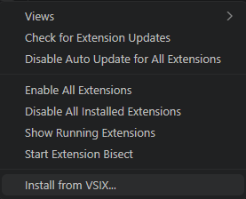

## この章で学ぶこと

- VS Code 拡張のパッケージ形式（VSIX）の役割を理解する
- エアギャップ環境への VSIX ファイルの持ち込み方を把握する
- Continue 拡張を GUI・CLI の両方の手順でインストールできるようになる
- インストールが正しく完了したことを確認する方法を身につける
- バージョン固定と社内配布の運用方針を学ぶ

---

## VSIX ファイルとは

VS Code の拡張機能は、通常 **VS Code Marketplace** を通じてインターネット経由でインストールします。しかしエアギャップ環境ではインターネットに接続できないため、Marketplace からの直接インストールは使用できません。

そこで活用するのが **VSIX ファイル**です。VSIX とは、VS Code 拡張機能を 1 つのファイルにまとめたパッケージ形式（拡張子 `.vsix`）です。これはいわば「拡張機能のインストーラー」であり、あらかじめインターネット接続環境でダウンロードしておいたうえで、エアギャップ環境に持ち込んでインストールします。

!!! note "VSIX ファイルの中身"
    VSIX は ZIP 形式のアーカイブです。中には拡張機能本体のコード、アイコン、`package.json`（メタ情報）などが含まれています。通常は中身を直接操作する必要はなく、VS Code にそのまま渡すだけで利用できます。

---

## 事前準備：VSIX ファイルの用意

VSIX ファイルの入手は、**インターネットに接続できる環境**で行います。エアギャップ環境への持ち込み前に、以下のいずれかの方法でファイルを用意してください。

### インターネット接続環境での VSIX ダウンロード

VS Code Marketplace の Web ページから VSIX ファイルを直接ダウンロードできます。

1. インターネット接続環境のブラウザで、Continue の VS Code Marketplace ページを開きます（参考リンク参照）。
2. ページ右側にある「**Download Extension**」リンクをクリックします。
3. `.vsix` ファイルがダウンロードされます。ファイル名は `Continue.continue-<バージョン番号>.vsix` のようになります。

!!! tip "バージョンを固定してダウンロードする"
    Marketplace の「Version History」タブから過去のバージョンを指定してダウンロードできます。社内で検証済みのバージョンを固定して取得することを推奨します（詳細は「[バージョン管理と社内配布の運用](#バージョン管理と社内配布の運用)」を参照）。

また、`vsce`（VS Code Extension Manager）コマンドラインツールを使ってダウンロードする方法もあります。

```bash
# vsce を使って VSIX をダウンロードする例（インターネット接続環境で実行）
npx vsce download Continue.continue --version 1.1.0
```

!!! warning "この操作はインターネット接続環境で実施してください"
    `npx` 実行時にパッケージのダウンロードが発生します。エアギャップ環境では実行できません。事前にインターネット接続環境で VSIX を取得してから持ち込んでください。

### 社内配布リポジトリからの取得

インターネット接続環境を持たない開発者向けに、社内の担当者があらかじめ VSIX ファイルを取得し、社内のファイルサーバや成果物リポジトリに配置していることがあります。

典型的な配置例を示します。

```text
\\<your-file-server>\tools\vscode-extensions\
└── Continue.continue-1.1.0.vsix
```

社内配布を利用する場合は、担当部門が指定するファイルサーバのパスまたは URL からファイルをコピーしてください。ファイル名にバージョン番号が含まれていることを確認してから持ち込んでください。

!!! note "ハッシュ値による改ざん検証"
    セキュリティポリシーによっては、ファイルの SHA-256 ハッシュ値を照合して改ざんがないことを確認することが求められる場合があります。担当部門から正規のハッシュ値が提供されている場合は、以下のコマンドで検証してください。

    ```bash
    # Linux / macOS
    sha256sum Continue.continue-1.1.0.vsix

    # Windows PowerShell
    Get-FileHash Continue.continue-1.1.0.vsix -Algorithm SHA256
    ```

---

## Continue 拡張のインストール手順

VSIX ファイルを用意できたら、エアギャップ環境の開発マシンにインストールします。VS Code の GUI を使う方法と、コマンドライン（CLI）を使う方法の両方を説明します。

### 拡張機能ビューからインストールする（GUI）

1. VS Code を起動します。
2. 左サイドバーの拡張機能アイコン（四角が 4 つ並んだアイコン）をクリックするか、`Ctrl+Shift+X`（macOS では `Cmd+Shift+X`）を押して、拡張機能ビューを開きます。
3. 拡張機能ビュー右上の「**…**」（省略記号）メニューをクリックします。
4. 表示されたメニューから「**VSIX からインストール…（Install from VSIX…）**」を選択します。

    

5. ファイル選択ダイアログが開くので、先ほど用意した `Continue.continue-<バージョン>.vsix` ファイルを選択して「**開く**」をクリックします。
6. インストールが完了すると、VS Code の右下に「**VSIX のインストールが完了しました。再起動しますか？**」というポップアップが表示されます。「**今すぐ再起動**」をクリックします。

!!! tip "再起動せずに有効化したい場合"
    「後で再起動」を選んだ場合でも、コマンドパレット（`Ctrl+Shift+P` / `Cmd+Shift+P`）から「**開発者: ウィンドウの再読み込み（Developer: Reload Window）**」を実行することで拡張機能を有効化できます。

### コマンドラインからインストールする（CLI）

ターミナルから `code` コマンドを使うと、スクリプトや CI/CD パイプラインに組み込めるため、複数台の開発マシンへの展開に便利です。

```bash
# VSIX ファイルを指定してインストールする
code --install-extension /path/to/Continue.continue-1.1.0.vsix
```

各オプションの意味は以下のとおりです。

| オプション | 意味 |
| --- | --- |
| `--install-extension` | 指定したパスの VSIX ファイルをインストールする |
| `/path/to/...` | VSIX ファイルの絶対パスまたは相対パス |

!!! tip "複数マシンへの一括展開例"
    社内の全開発マシンに同じバージョンを一括展開するには、シェルスクリプトを用意して配布する方法が便利です。

    ```bash
    #!/usr/bin/env bash
    # deploy-continue.sh: Continue 拡張を一括インストールするスクリプト例
    VSIX_PATH="/mnt/<your-file-server>/tools/vscode-extensions/Continue.continue-1.1.0.vsix"

    code --install-extension "$VSIX_PATH"
    echo "Continue 拡張のインストールが完了しました。"
    ```

    `<your-file-server>` は社内ファイルサーバのホスト名またはパスに置き換えてください。

---

## インストールの確認

インストール後、以下の手順で Continue 拡張が正しく有効化されているかを確認します。

### サイドバーアイコンで確認する

VS Code の左サイドバーに Continue のアイコン（波状のロゴ）が表示されていれば、拡張機能は正常に有効化されています。アイコンをクリックすると Continue のパネルが開きます。

### 拡張機能ビューで確認する

1. 拡張機能ビュー（`Ctrl+Shift+X` / `Cmd+Shift+X`）を開きます。
2. 検索ボックスに「Continue」と入力します。
3. 一覧に Continue が表示され、「**有効**」の状態になっていることを確認します。インストール済みのバージョン番号もここで確認できます。

### コマンドラインで確認する

```bash
# インストール済み拡張機能の一覧から Continue を検索する
code --list-extensions | grep -i continue
```

`Continue.continue` が出力されればインストール成功です。

!!! warning "拡張機能が表示されない場合"
    インストール後に VS Code を再起動してもアイコンが表示されない場合は、[第 14 章 トラブルシューティング](14-troubleshooting.md) を参照してください。よくある原因として、VSIX ファイルの破損やバージョンと VS Code の互換性問題が挙げられます。

---

## バージョン管理と社内配布の運用

エアギャップ環境では、拡張機能の自動更新が機能しません。そのため、社内での計画的なバージョン管理と配布運用が重要になります。

### バージョンを固定する理由

Continue は頻繁にアップデートされており、新しいバージョンでは設定ファイル（`config.yaml`）の仕様や機能の動作が変わることがあります。エアギャップ環境でバージョンを固定することには、以下のメリットがあります。

- **動作の安定性**: 検証済みのバージョンで全開発者の動作を揃えられる
- **トラブル対応の容易さ**: 全員が同じバージョンを使うことで、問題の再現・切り分けがしやすい
- **変更管理への対応**: セキュリティポリシーや変更管理プロセスに沿って、計画的にアップグレードできる

バージョンを固定するには、前述のとおり Marketplace の「Version History」から特定バージョンの VSIX をダウンロードし、社内配布リポジトリに保管します。

### バージョンアップ時の手順

新しいバージョンへの移行は、以下の流れで実施することを推奨します。

1. **検証環境で動作確認**: インターネット接続環境または検証用マシンで新バージョンをテストし、既存の `config.yaml` との互換性を確認する
2. **社内配布リポジトリへの登録**: 検証が完了したら、新バージョンの VSIX を社内ファイルサーバに配置する
3. **旧バージョンのアンインストール**: 開発者マシンで旧バージョンをアンインストールする

    ```bash
    # 旧バージョンをアンインストールする
    code --uninstall-extension Continue.continue
    ```

4. **新バージョンのインストール**: 前節の手順で新バージョンの VSIX をインストールする
5. **動作確認**: インストール後に VS Code を再起動し、正常に動作することを確認する

!!! note "config.yaml の互換性確認"
    メジャーバージョン更新（例: 0.x → 1.x）では、`config.yaml` の構造が変わる場合があります。アップグレード前に Continue の公式リリースノート（インターネット接続環境で確認）を参照し、設定の変更が必要かどうかを事前に確認してください。`config.yaml` の詳細については [第 5 章 config.yaml の基本構造](05-config-yaml-basics.md) で扱います。

---

## まとめ

- VS Code 拡張の VSIX ファイルは、Marketplace を使わずにオフラインでインストールするためのパッケージ形式です
- VSIX ファイルの取得はインターネット接続環境で行い、社内配布リポジトリを通じてエアギャップ環境に持ち込みます
- インストールは GUI（拡張機能ビュー）と CLI（`code --install-extension`）の両方の方法で実施できます
- インストール後はサイドバーアイコン・拡張機能ビュー・コマンドラインで正常に有効化されたことを確認します
- エアギャップ環境では自動更新が機能しないため、社内でバージョンを固定し、計画的にアップグレードを管理することが重要です

## 次の章へ

次は [第 4 章 テレメトリと外部通信の遮断確認](04-telemetry-airgap-verification.md) で、Continue が外部サーバへ通信を行っていないことを検証する方法を扱います。監査担当者へのエビデンス提出にも役立つ内容です。

## 参考リンク

- [VS Code 公式ドキュメント: Install from VSIX](https://code.visualstudio.com/docs/editor/extension-marketplace#_install-from-a-vsix)
- [Continue の VS Code Marketplace ページ](https://marketplace.visualstudio.com/items?itemName=Continue.continue)
- [Continue 公式 GitHub リリースページ](https://github.com/continuedev/continue/releases)
- [VS Code Extension Manager (vsce)](https://github.com/microsoft/vscode-vsce)
